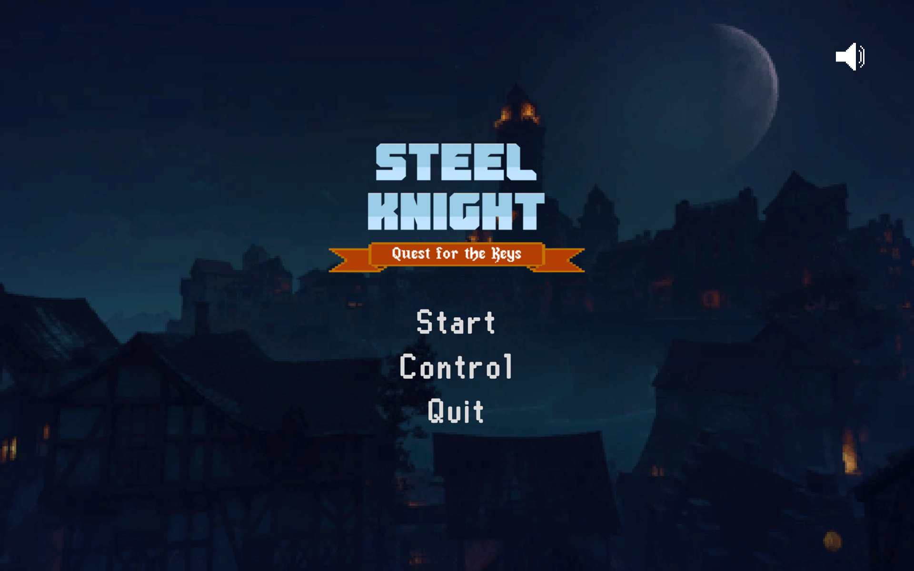
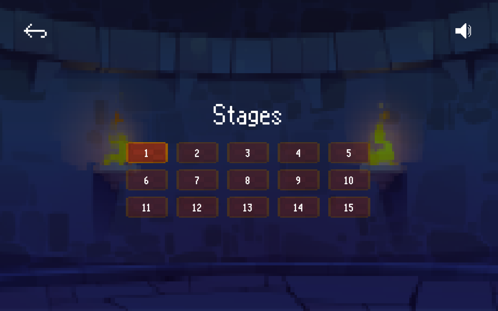
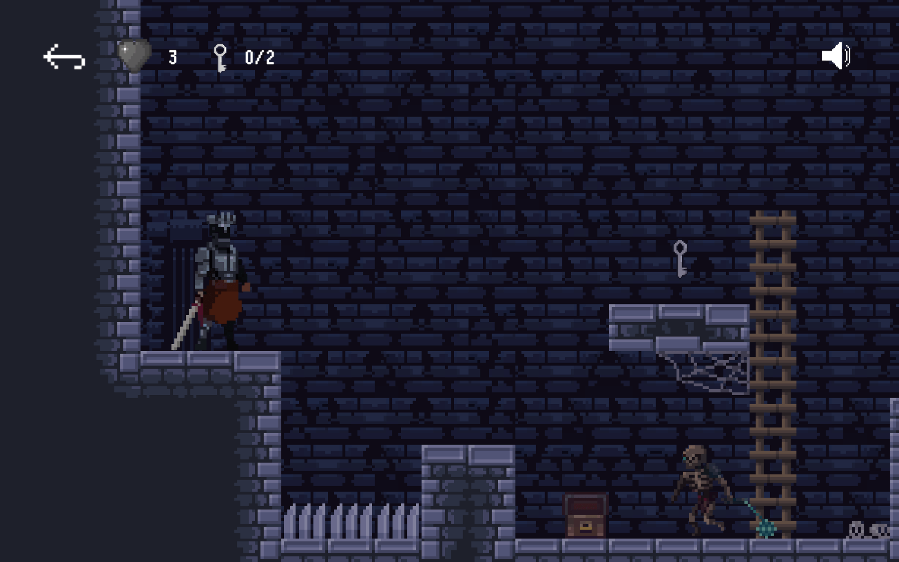

# Steel Knight
The Steel Knight in the catacombs. You need to pick up 2 keys to go to the next level,

## Screenshot

## Controls
| Key | Command |
| --- | --- |
| <kbd>A</kbd>, <kbd>D</kbd> or <kbd>←</kbd>, <kbd>→</kbd> | Move |
| <kbd>Z</kbd>, <kbd>↑</kbd>, <kbd>Space</kbd> | Jump |
| <kbd>X</kbd>, <kbd>K</kbd>| Attack|
| <kbd>Esc</kbd> | Menu|

## Assets
* Character by Szadiart
* Skeleton by AstroBob
* Tilesets by Genewheel, David G
* Door by JitsuKoan
* Heart by Cup Coffee
* Keys by Frontend Pashtet
* Font RuneScape UF by Nathan P
* Font Glasstown NBP by Nate Halley
